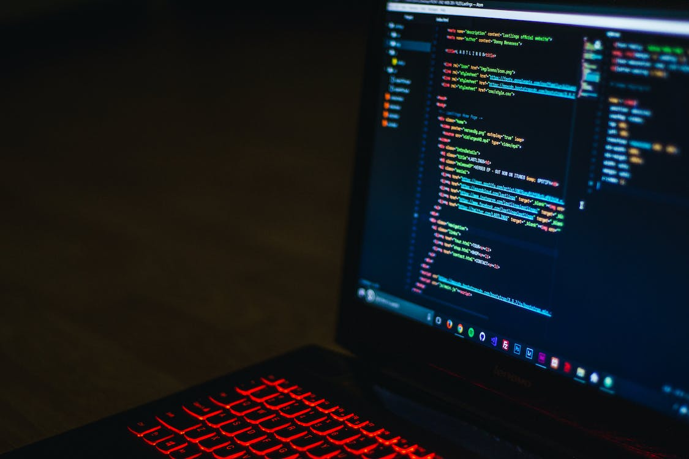

# Awesome Inc U Web Dev Bootcamp Week 1 👨‍💻 #

## Git Her Done 🤙 ## 

Learning this week at the remote bootcamp with Awesome Inc U has been **great**! This week we all of course met for the first time, talked about the values and culture of Awesome Inc, setup our work environments and also began to code with some of the fundamental coding language like HTML5 and CSS3. The week has already gone by so fast as we are about halfway through as I am writing this and I already feel like so much information has been shared, which is a good thing. This is what I expected going into the bootcamp from my own personal research with other bootcamp reviews so I'm not surprised. It has been said that we are essentially drinking from a firehose 🌊🌊🌊. Of course, we want to absorb as much information as we can as the bootcamp goes on. Being a remote bootcamp is great as well because it allows me to work in the comfort of my own home, be close to my wife and our beautiful daughter, and get Ale8 out of the fridge whenever I crave one. The one downside is missing human interaction. Actually getting to interact and be around each other as we learn together is hard to give up, but we have all done well comunicating through the Slack channel and my instructors and classmates all seem to be very vibrant and encouraging people. 💯💯💪

The main things we covered this week are: GitHub, Git, Gitpod, CLI, HTML5, and CSS3. Initially learning all the differences in Git was a *bit* overwhelming 😪, but things made sense after a while and my challenge to myself is to learn the CLI and improve how fast I can use it within the Gitpod terminal. HTML5 and CSS3 are subjects I am pretty familiar with through my own teaching and the part time Intro to Web course I took at Awesome Inc earlier this year. Going over those 2 fundamental languages and trying to grasp more in depth concepts with them is refreshing and inspires me to be the best I can be in both of those. I would **love** to learn more about CSS animations and how to integrate those into a visually pleasing site. I am looking forward to taking a dive into JS and React, and eventually Python and Django. 

My hopes for this bootcamp as we continue to push through new subjects everyday, is that we will continue to collaborate effectively, communicate well together, and build a great foundation and portfolio necessary to get us to the end goal: OUR FIRST DEV JOBS! 🔥🔥🔥🔥  But, until then, all we can do is take one day at a time and learn the best we can. Throughout this blog, you may discover that I love playing video games 🎮, (especially Fortnite.. I know, I'm that guy), that I am a recent father to a beautiful daughter 👨‍👩‍👧 who decided to make a career change 👀, and that I love food 🤤🍕🍻 (although I am a terrible cook). 

